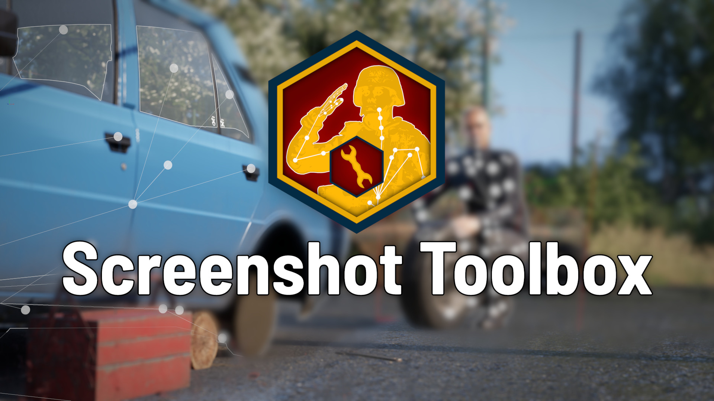
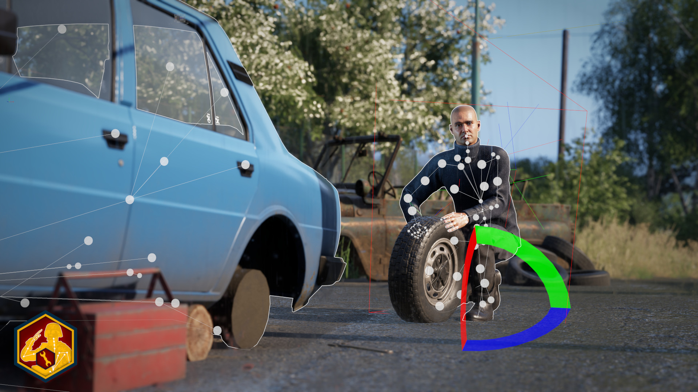

  

# Screenshot Toolbox – Bone Manipulator

A Workbench tool for **Arma Reforger** that enables direct skeleton posing through custom viewport interaction.
This tool is designed to significantly speed up pose manipulation for screenshots taken in the Workbench by providing a custom workflow, including hand-built gizmos and overlay rendering. It integrates seamlessly with animation tracks, effectively replacing the traditional bone manipulator workflow.

[Workshop page](https://reforger.armaplatform.com/workshop/68CCF1A8B06248CB-ScreenshotToolbox) | [Overview & Explanation video](https://www.youtube.com/watch?v=1XAyPcLcFC4)

---

## Overview

  

The Bone Manipulator allows you to directly pose skeletons inside the Workbench viewport by interacting with bones via custom visual handles.

Unlike the default workflow, which requires **one track per bone**, this tool only requires **one track per entity**, significantly simplifying setup and editing.

It is designed to:

* Enable fast iteration on poses
* Provide direct, visual control over individual bones
* Work without requiring other mods as dependencies

This project deliberately pushes the limits of what Workbench tools were originally designed for, which results in some unconventional behavior and implementation details.

---

## Features

* Direct bone selection via viewport overlays
* Custom-built gizmos for:
  * Position
  * Rotation
  * Scale
* Real-time pose manipulation
* Filter options for a clearer workspace
* Compatible with most entities that have a bones

---

## Hotkeys

* <kbd>U</kbd> – Rotation gizmo
* <kbd>I</kbd> – Position gizmo
* <kbd>O</kbd> – Scale gizmo
* <kbd>J</kbd> – Reset selected bone
* <kbd>ESC</kbd> – Exit bone edit mode

> Hotkeys are intentionally unusual because Workbench tools can only bind keys that are not already used by the editor.

> Hotkeys can be changed in the tool, but you can still only use keys that are unused by the Workbench. This is a limitation on BI's side.

---

## Support & Bug Reports

For bug reports, please [open an issue on GitHub](https://github.com/Hexomanya/screenshot-toolbox/issues).

For general support, I am most active in the **Screenshot Toolbox** forum post in the `#enf_showcase` channel on the official Arma Discord.

* [Join the official Arma Discord](https://discord.gg/FbbcC5Tg)
* [Go directly to the Screenshot Toolbox thread](https://discord.com/channels/105462288051380224/1493383988453314740) *(requires being in the server first)*

---

## Usage (Workbench)

1. Open your project in the Arma Reforger Workbench
2. Select the entity you want to adjust the pose of
3. If you want to work with an animation, set it up normally at this point
4. Select the **Bone Manipulator** tool at the top (bone symbol)
5. Use the **Create Component → Create Config → Create Track** buttons to set up the entity
6. Click on a bone (displayed as a sphere) to select it
7. Use hotkeys to switch manipulation modes
8. Drag the gizmo to manipulate the bone
9. Press the **Save Edits** button to save, or exit the tool to discard your changes

Also shown in the [Overview & Explanation video](https://www.youtube.com/watch?v=1XAyPcLcFC4).

---

## Technical Notes

This project stretches the Workbench tool system far beyond its typical use case:

* All gizmos are **fully custom-built**, not engine-provided
* Bone overlays and interaction logic are entirely manual
* Input handling is constrained by Workbench limitations
* Some UI behaviors are limited by the API

Example limitation:

* Certain settings (e.g. filters) only apply when the mouse re-enters the viewport, rather than updating immediately on change

These constraints are a direct result of the tool API limits.

---

## Installation

### As a mod

1. Download the mod from the [Workshop](https://reforger.armaplatform.com/workshop/68CCF1A8B06248CB-ScreenshotToolbox)
2. Open the Workbench and add it as a project
3. Right-click your project → Open with Addons
4. Select ScreenshotToolbox

### Manual Installation

1. Download or clone this repository
2. Copy the `scripts` folder into your project directory
3. Compile the scripts
4. Reload WB scripts

This tool does **not** need to be added as a dependency to your project.

---

## Known Issues

* Applying multiple layered pose modifications (e.g. combining several animation overrides on the same bone) is not supported right now.
* Removing a config and adding a new one without closing the tool may cause the tool to retain the old bone rotations.
* The move gizmo can break if used on a bone in a chain that already has transforms applied (e.g. moving the hand when the shoulder is already rotated).

---

## Planned Features

* Basic IK support (hands and feet)
* Invert poses / animation frames
* Toggle for world/local position and rotation

---

## Planned Fixes

* Warning for entity names containing underscores (track compatibility)
* Gizmo code restructuring

---

## License

This project is licensed under the MIT License.
You are free to use, modify, and distribute the software, provided that the original license and copyright notice are included.

---

## Development Notes

This project was written manually. AI tools were only used for:

* Bug identification
* Formatting and documentation
* Gizmo shape generation